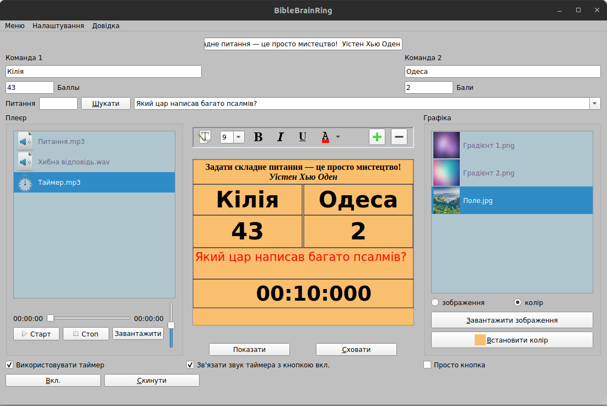

## BibleBrainRing
This application is intended for use in competitions. It displays on the screen and on the projector the names of the commands, the number of points and the task is asked. Also in this program you can play music and sounds and do different types of settings. The program uses the following classes: QGraphicsScene, QGraphicsTextItem, QMediaPlayer, QDesktopWidget...

## BibleBrainRing

## Develop
- [How to build in QtCreator?](docs/README-How-to-build-in-QtCreator.md)
- [How to deploy Linux AppImage?](docs/README-How-to-deploy-Linux-AppImage.md)
- [How to deploy Windows Exec?](docs/README-How-to-deploy-Windows-Exec.md)
